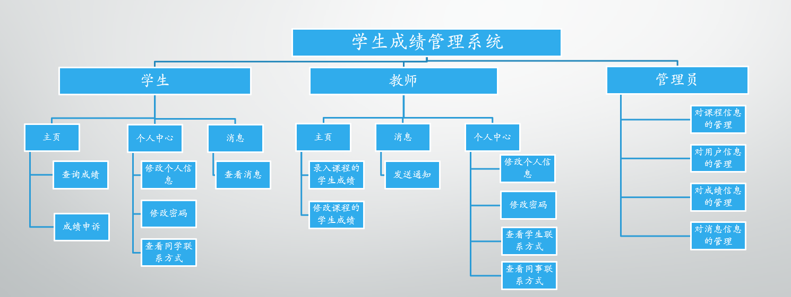

# 学生成绩管理系统

这是一个基于Android+Django+sqlit3开发的学生成绩管理系统，项目分为客户端和服务器端：
- 客户端：
    - GitHub：[https://github.com/kleinlsl/XSGManage](https://github.com/kleinlsl/XSGManage)
- 服务器：
    - Github：[https://github.com/kleinlsl/XSGM](https://github.com/kleinlsl/XSGM)

# clone

```
# clone warehouse
$ git clone https://github.com/kleinlsl/XSGM.git
```

## Configuration

```shell
>cd XSGM
>pip install -r requirements.txt
>python manage.py help   #查看如何运行Django
>python manage.py runserver 127.0.0.1:8000   #在本机8000端口运行服务
```

- 主界面：[127.0.0.1:8000](http://127.0.0.1:8000/)
- 后台管理界面：[127.0.0.1:8000/admin](http://127.0.0.1:8000/admin)
  - 用户名：admin     密码：admin

# 项目功能结构
> 项目分为三类用户：学生、教师和管理员。学生和教师通过Android进行访问，管理员通过Django-web后台管理。



# 服务端项目结构

```
D:.
├─.idea    //自动生成的文件，建议删除
├─app	   //django应用app
│  ├─migrations
│  │  └─__pycache__
│  ├─__init__.py
│  ├─admin.py   //后台界面展示配置
│  ├─apps.py    
│  ├─models.py  //定义数据库模型：ORM关系对象模型映射
│  ├─tests.py   //编写当前app单元测试
│  └─views.py   //view视图事务处理，接收http请求处理
├─config	//存放照片
│  └─user
│      └─2019
│          └─12
├─project-file	//项目相关文件
│  └─image
├─static     //存放静态文件
│  └─admin	//Django后台自动生成
│      ├─css
│      │  └─vendor
│      │      └─select2
│      ├─fonts
│      ├─img
│      │  └─gis
│      └─js
│          ├─admin
│          └─vendor
│              ├─jquery
│              ├─select2
│              │  └─i18n
│              └─xregexp
├─templates //html模板目录
├─venv      //python虚拟环境，建议删除新建虚拟环境
│  ├─Include
│  ├─Lib
│  └─。。。。。
├─XSGM    //Django
│  └─__pycache__
│  ├─__init__.py
│  ├─asgi.py    
│  ├─settings.py  //Django配置文件
│  ├─urls.py    //路由映射
│  └─wsgi.py
├─db.sqlite3  //sqlite3数据库文件
├─manage.py  
├─readme.md
└─requirements.txt   //依赖库

```

# 项目相关界面

> 参见此处：[here](project-file)

# 项目相关依赖
```jshelllanguage
    asgiref==3.2.3
    Django==2.2.10
    django-multi-captcha-admin==1.0.0
    django-ranged-response==0.2.0
    django-simple-captcha==0.5.12
    Pillow==6.2.2
    pytz==2019.3
    six==1.13.0
    sqlparse==0.3.0
```

# references.md
> 参见此处:[here](project-file/references.md)
